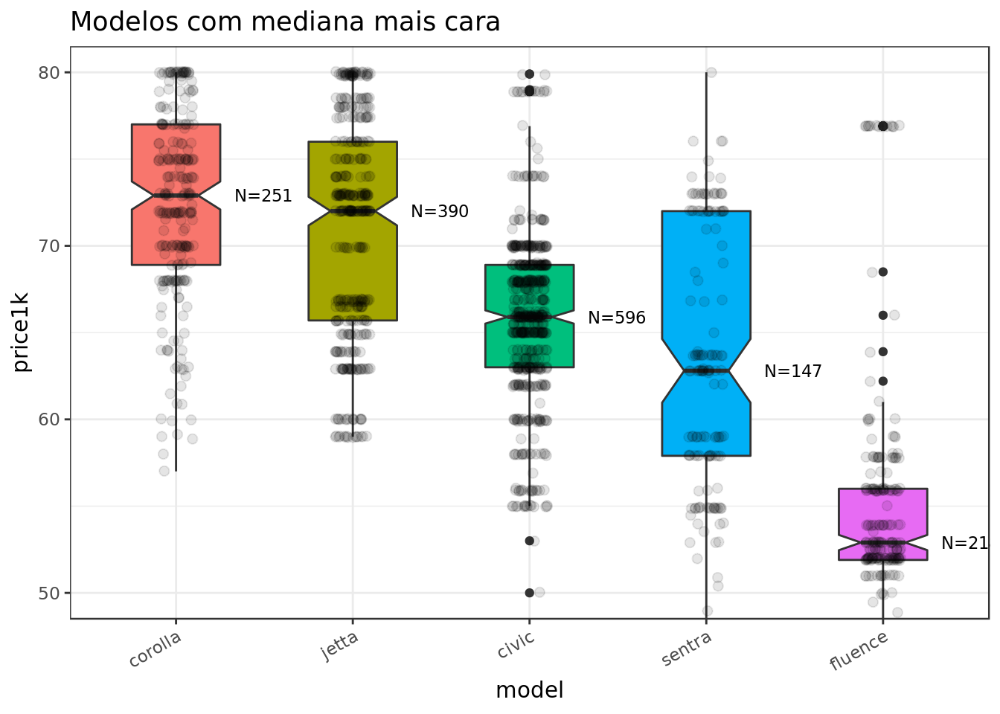
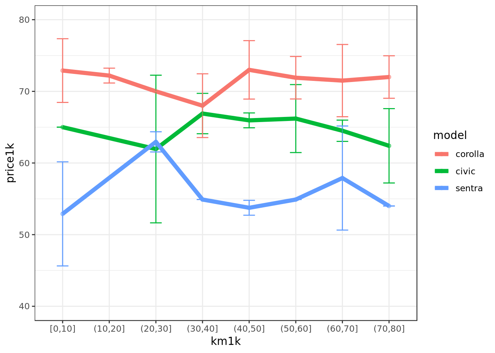
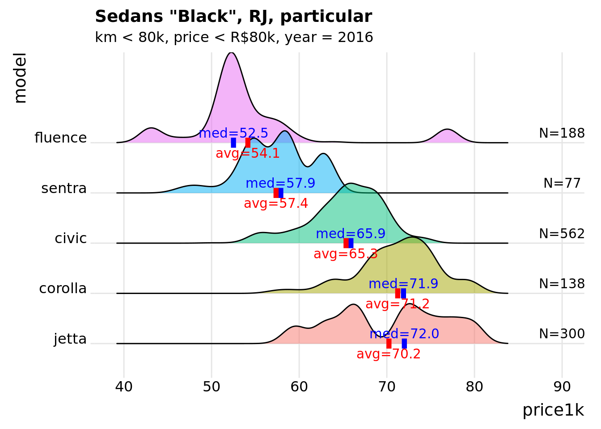

This is an example of a scrape of the [OLX](olx.com.br) site in Brazil to compare used car prices for cars in the Imported Compact Sedan category (Corollas, Sentras, Jettas, etc).

In the companion [website](https://dan-reznik.github.io/OLX-Car-Ad-Scraper/), you can see the scraping code, which produces the following results:

### Compare prices of main models

```{r}

```

### Compare price change against mileage range (in km)

```{r}

```

### Categorize certain messages as suspicious if they contain certain words

```{r}
knitr::include_graphics("pics/compare w sentiment.png")
```

### Recalculate mean prices eliminating suspicious messages

```{r}

```

