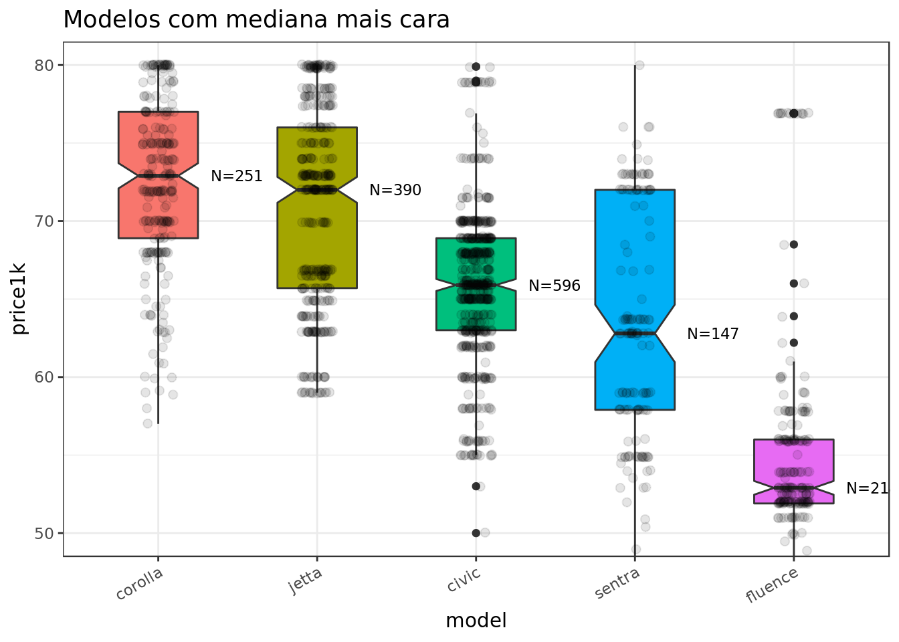
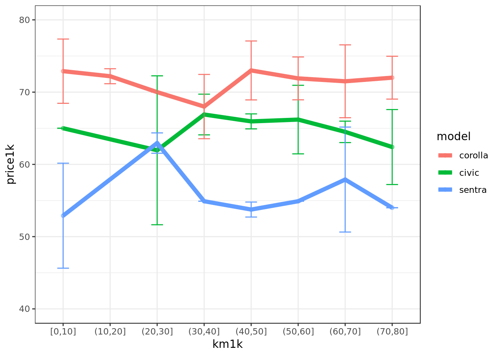
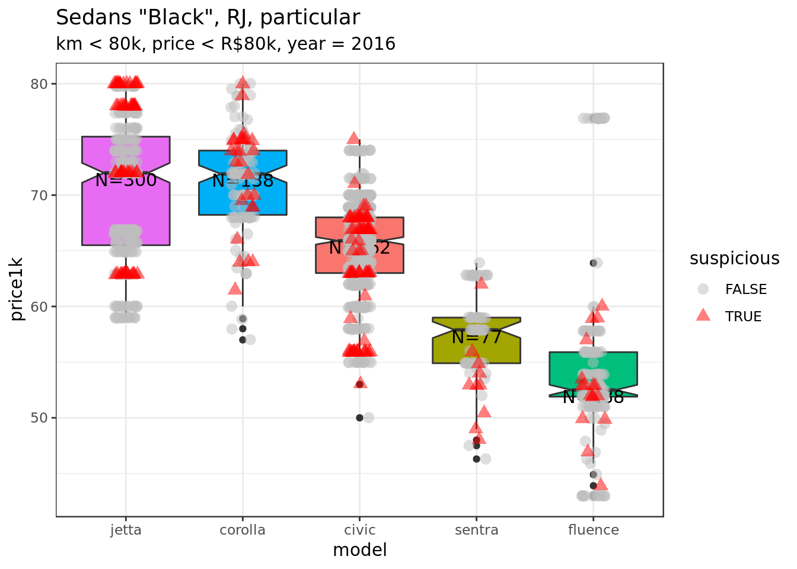
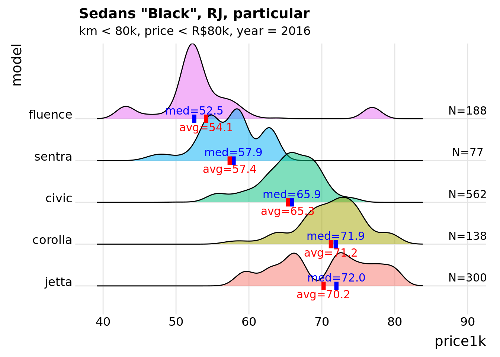

OLX Scraper: Car Prices
================

``` r

```


We will scrape [OLX](olx.com.br) in Brazil to compare used car prices for cars in the imported compact sedan category (Corollas, Sentras, Jettas, etc).

Refer to the companion [website](https://dan-reznik.github.io/OLX-Car-Ad-Scraper/) for low-level scraping code. Below the main results are shown:

### Price comparison per model

``` r

```


### Price change against mileage range (in km)

``` r

```


### Show data points containing suspicious words (price is not reliable)

``` r

```


### Recalculate mean prices eliminating suspicious messages

``` r

```


